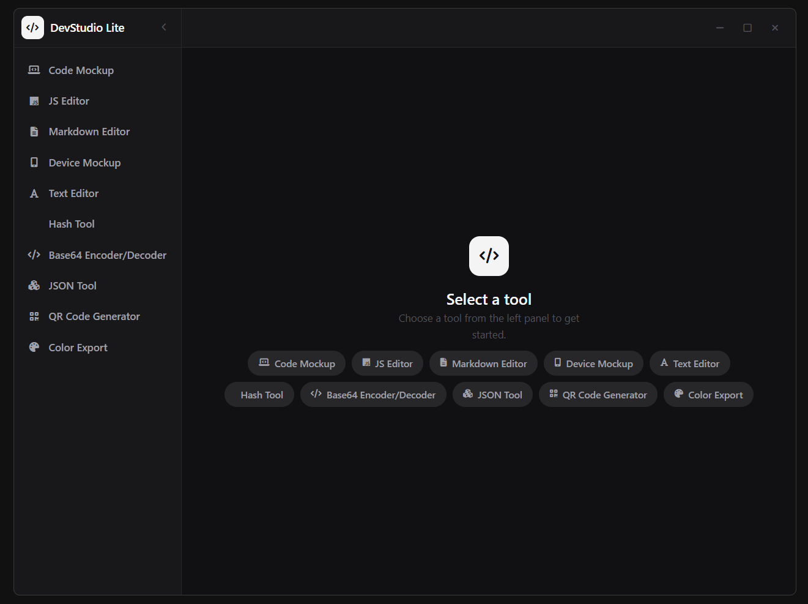

# 🚀 DevStudio Lite

**DevStudio Lite** is a free, modern desktop developer toolkit built with **Go + Wails + Angular**.
It provides a collection of useful tools for developers and creators — all in one clean, fast, and minimal UI.

---

## ✨ Features

* 💻 Code Mockup Generator
* 🧠 JavaScript Editor
* 📝 Markdown Editor
* 📱 Device Mockup Viewer
* ✍️ Text Editor
* 🔐 Hash Generator Tool
* 🔄 Base64 Encoder / Decoder
* 📦 JSON Viewer & Formatter
* 🎨 Gradient Generator
* ⚡ Fast & lightweight desktop experience

> More tools coming soon...

---

## 🖼️ Preview



---

## 🧰 Built With

* 🟦 Go (Backend)
* ⚡ Wails
* 🅰️ Angular
* 🟨 TypeScript
* 🎨 SCSS / TailwindCSS (if used)

---

## 📦 Installation & Setup

### Prerequisites

* Node.js (v16+ recommended)
* Go (v1.20+)
* Wails CLI

Install Wails CLI:

```bash
go install github.com/wailsapp/wails/v2/cmd/wails@latest
```

---

### Run in Development

```bash
npm install
wails dev
```

---

### Build Production App

```bash
wails build
```

---

## 📁 Project Structure

```
DevStudio-Lite/
│
├── build/              # App assets (icons, metadata)
├── frontend/           # Angular frontend
├── app.go              # Go app logic
├── main.go             # Entry point
├── wails.json          # Wails config
├── package.json
└── README.md
```

---

## 🎯 Purpose

DevStudio Lite is designed to:

* Improve developer productivity
* Provide quick access to useful tools
* Reduce dependency on multiple websites
* Offer a clean desktop experience

---

## 💡 Future Plans

* 🔒 DevStudio Pro (offline + premium tools)
* 📁 Save & workspace features
* ⚙️ More advanced developer utilities
* 🌐 Plugin / tool marketplace

---

## 🤝 Contributing

Contributions are welcome!

If you'd like to improve this project:

1. Fork the repo
2. Create a new branch
3. Make your changes
4. Submit a Pull Request

---

## ⭐ Support

If you like this project:

* ⭐ Star this repository
* 🔁 Share it with others
* 💬 Give feedback

---

## 📄 License

This project is licensed under the **MIT License**.

---

## 👤 Author

**Krishna**
📧 [codewithkrishna.dev@gmail.com](mailto:codewithkrishna.dev@gmail.com)

---

## 🔥 Note

This is the **free version (DevStudio Lite)**.

A premium version (**DevStudio Pro**) with:

* Offline tools
* More features
* Enhanced experience

will be released soon.

---
